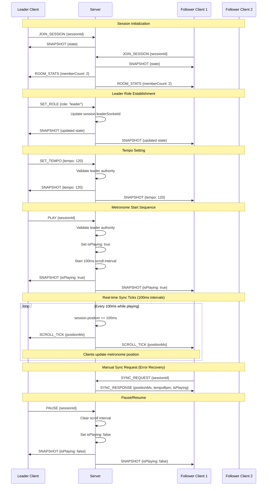
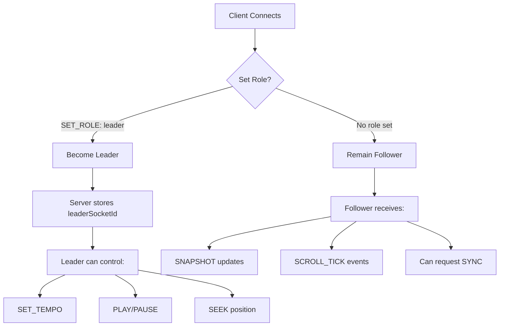
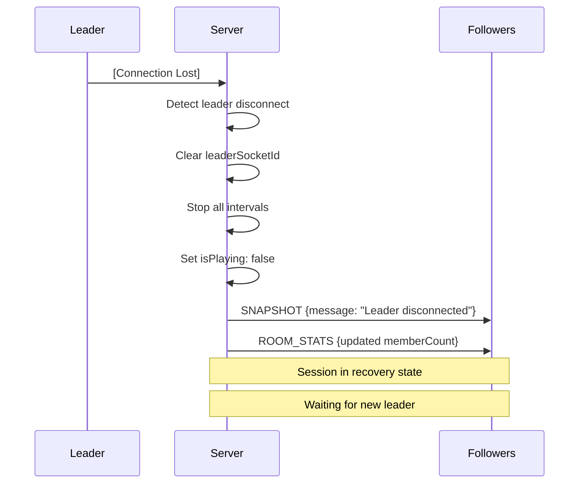
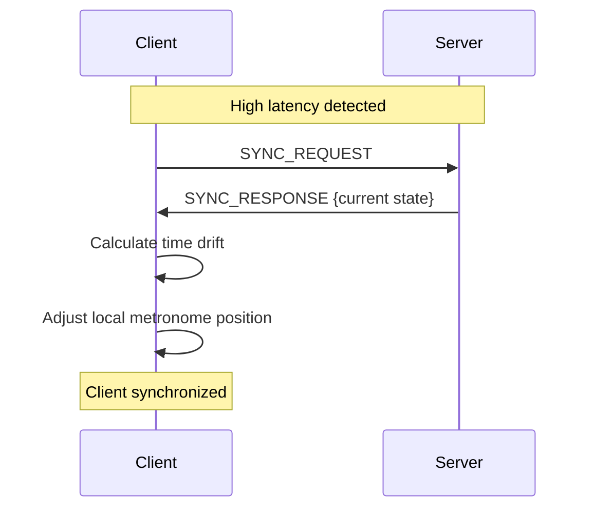

# BandSync Real-Time Synchronization Sequence Diagram

## Metronome Event Flow Architecture

### Overview
This document outlines the real-time synchronization architecture for BandSync metronome events, including timing considerations, leader/follower roles, and error handling patterns.

### Core Synchronization Flow



### Timing Architecture Details

#### 1. Server-Side Timing Engine
```javascript
// Core timing mechanism (from server.js)
const scrollInterval = setInterval(() => {
  const session = sessions.get(sessionId);
  if (session && session.isPlaying) {
    session.position += 100; // 100ms precision
    io.to(sessionId).emit(EVENTS.SCROLL_TICK, { 
      sessionId, 
      positionMs: session.position 
    });
  }
}, 100);
```

**Timing Characteristics:**
- **Base Resolution**: 100ms ticks
- **Target Latency**: <100ms end-to-end
- **Synchronization Accuracy**: ±50ms across clients

#### 2. Client-Side Synchronization
```javascript
// Client sync handling (from useSocket.js)
socket.on("scroll_tick", (data) => {
  if (data.sessionId === sessionId) {
    setState(prevState => ({
      ...prevState,
      position: data.positionMs
    }));
  }
});
```

### Leader/Follower Role Architecture

#### Leader Authority Model


#### Authority Validation Pattern
```javascript
// Server-side authority check pattern
socket.on(EVENTS.SET_TEMPO, ({ sessionId, tempo }) => {
  const session = sessions.get(sessionId);
  if (!session) return;
  
  // Authority validation
  if (session.leaderSocketId !== socket.id) {
    console.log(`BLOCKED SET_TEMPO: ${socket.id} not leader`);
    return;
  }
  
  // Execute authorized action
  session.tempo = tempo;
  io.to(sessionId).emit(EVENTS.SNAPSHOT, session);
});
```

### Error Handling & Resilience Patterns

#### 1. Leader Disconnection Recovery


#### 2. Network Latency Compensation


#### 3. Connection Recovery Pattern
```javascript
// Client-side reconnection handling
socket.on("connect", () => {
  setConnected(true);
  // Re-join session on reconnect
  socket.emit("join_session", { sessionId });
});

socket.on("disconnect", () => {
  setConnected(false);
  // UI should indicate disconnected state
});
```

### Performance Characteristics

#### Current Architecture Limits
- **Concurrent Sessions**: Limited by server memory (in-memory Map)
- **Members per Session**: Limited by Socket.IO room broadcasting
- **Timing Precision**: 100ms intervals with ±50ms accuracy
- **Network Requirements**: WebSocket persistent connection

#### Scaling Bottlenecks
1. **Single Server Instance**: No horizontal scaling
2. **In-Memory State**: No persistence or recovery
3. **Synchronous Broadcasting**: All events sent to all members
4. **No Load Balancing**: Single point of failure

### Recommended Improvements

#### 1. Enhanced Timing Precision
```javascript
// Proposed: Higher precision timing with drift correction
const TICK_INTERVAL = 50; // 50ms for better precision
const session = {
  startTimestamp: Date.now(),
  position: 0,
  tempo: 120,
  isPlaying: true
};

// Calculate position based on elapsed time
const getAccuratePosition = (session) => {
  if (!session.isPlaying) return session.position;
  const elapsed = Date.now() - session.startTimestamp;
  return session.position + elapsed;
};
```

#### 2. Connection Quality Monitoring
```javascript
// Proposed: RTT monitoring for sync quality
socket.on('ping', (callback) => {
  const start = Date.now();
  callback();
  const rtt = Date.now() - start;
  
  if (rtt > 200) {
    // High latency - request sync
    socket.emit(EVENTS.SYNC_REQUEST, { sessionId });
  }
});
```

#### 3. Predictive Synchronization
```javascript
// Proposed: Client-side prediction with server correction
const predictPosition = (lastKnownPosition, tempo, elapsedMs) => {
  const beatsPerMs = tempo / 60000;
  const predictedBeats = elapsedMs * beatsPerMs;
  return lastKnownPosition + (predictedBeats * (60000 / tempo));
};
```

### Event Message Specifications

#### Core Events
```typescript
interface JoinSessionEvent {
  sessionId: string;
}

interface SnapshotEvent {
  message: string;
  tempo: number;
  position: number; // milliseconds
  isPlaying: boolean;
  leaderSocketId: string | null;
  tempoBpm: number;
}

interface ScrollTickEvent {
  sessionId: string;
  positionMs: number;
}

interface SyncResponseEvent {
  sessionId: string;
  positionMs: number;
  tempoBpm: number;
  isPlaying: boolean;
}
```

### Implementation Status
- ✅ Basic leader/follower architecture implemented
- ✅ 100ms tick-based synchronization active
- ✅ Leader authority validation in place
- ✅ Disconnect recovery handling working
- ⚠️ No drift correction or latency compensation
- ⚠️ No performance monitoring or quality metrics
- ⚠️ Limited to single server instance